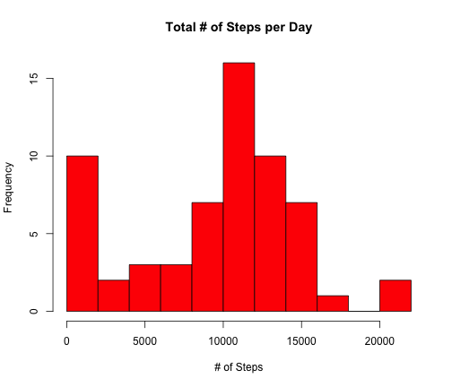
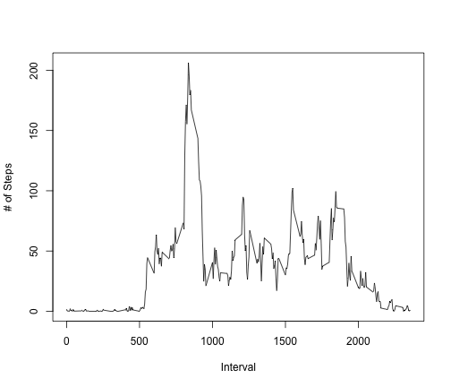
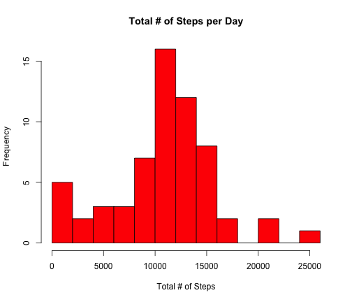
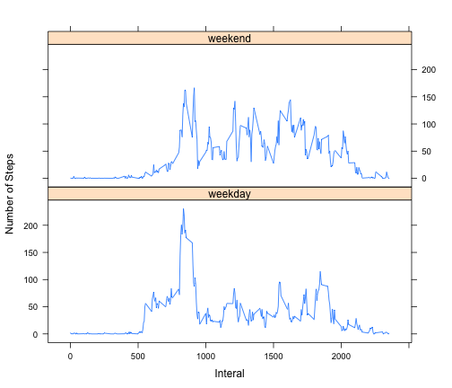

Reproductive Research Assignment 1
=======================================================


```r
library(knitr)
library(lattice)
```

Load the data (i.e. read.csv())

```r
setwd("/Users/katherinezhang/Desktop/Coursera R")
act<-read.csv("activity.csv")
```

Transform date to date format 

```r
act$date <- as.Date(act$date)
```

Make a histogram of the total number of steps taken each day

```r
PerDay<-tapply(act$steps,act$date,sum,na.rm=TRUE)
hist(PerDay,10,col = "red",xlab="# of Steps",main="Total # of Steps per Day")
```

 

Calculate mean and median total number of steps taken per day

```r
mean(PerDay)
```

```
## [1] 9354.23
```

```r
median(PerDay)
```

```
## [1] 10395
```

Make a time-series plot of avarege number of steps per interval by interval

```r
PerInterval<-aggregate(act$steps,by=list(interval=act$interval),FUN=mean,na.rm=TRUE)
plot(PerInterval$interval,PerInterval$x,type="l",col="black",ylab="# of Steps",xlab="Interval")
```

 

8:35AM contains he maixmum number of average step (206 steps)  

```r
maxrow<-which.max(PerInterval$x)
PerInterval[maxrow,]
```

```
##     interval        x
## 104      835 206.1698
```

There are 2,304 rows with missing value  

```r
sum(is.na(act$steps))
```

```
## [1] 2304
```

Impute the missing value using the mean of that 5-minutes interval 

```r
Missing<-act[is.na(act$steps),]
NoMissing<-act[!is.na(act$steps),]
Missing<-merge(Missing,PerInterval,by="interval")
MissingImpute<-Missing[,c("x","date","interval")]
names(MissingImpute)[1]="steps"
actImpute<-rbind(NoMissing,MissingImpute)
```

Make a histogram using the imputed activity data

```r
PerDayImpute<-tapply(actImpute$steps,act$date,sum)
hist(PerDayImpute,10,col = "red",xlab="Total # of Steps",main="Total # of Steps per Day")
```

 

Recalcuate Mean and Median using the imputed actvity data 

```r
mean(PerDayImpute)
```

```
## [1] 10766.19
```

```r
median(PerDayImpute)
```

```
## [1] 11015
```

Imputed activity data, compared to original data, has higher mean and median

```r
mean(PerDayImpute)-mean(PerDay)
```

```
## [1] 1411.959
```

```r
median(PerDayImpute)-median(PerDay)
```

```
## [1] 620
```

Create "weekend"/"weekday" factor

```r
weekdays<-weekdays(actImpute$date)
weekdays<-replace(weekdays,weekdays=="Sunday"|weekdays=="Saturday","weekend")
weekdays<-replace(weekdays,!(weekdays=="weekend"),"weekday")
actImpute$fWeekday=factor(weekdays)
```

Make a panel plot 

```r
PerIntervalImpute<-aggregate(actImpute$steps,by=list(interval=actImpute$interval,fWeekday=actImpute$fWeekday),FUN=mean)
xyplot(x~interval|fWeekday,data=PerIntervalImpute,xlab="Interal",ylab="Number of Steps",type="l",layout=c(1,2))
```

 

The plot shows that there are more activities in early morning on weekdays than on weekends 
